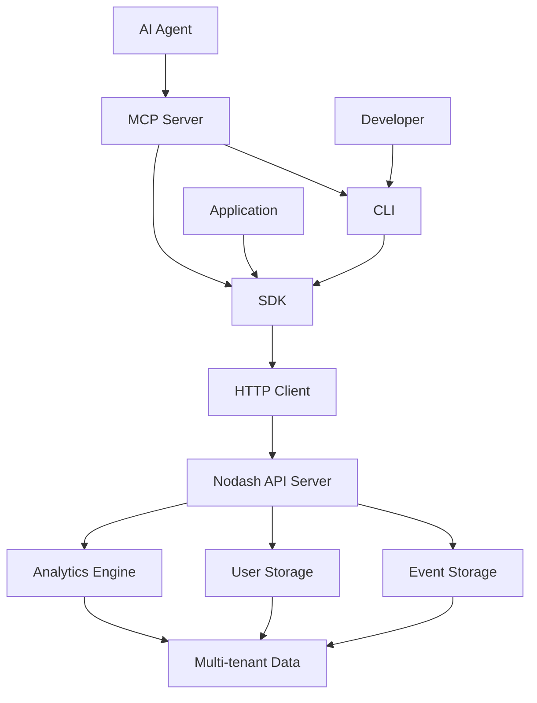
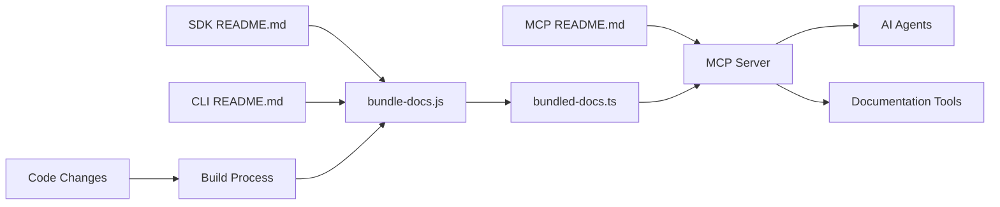
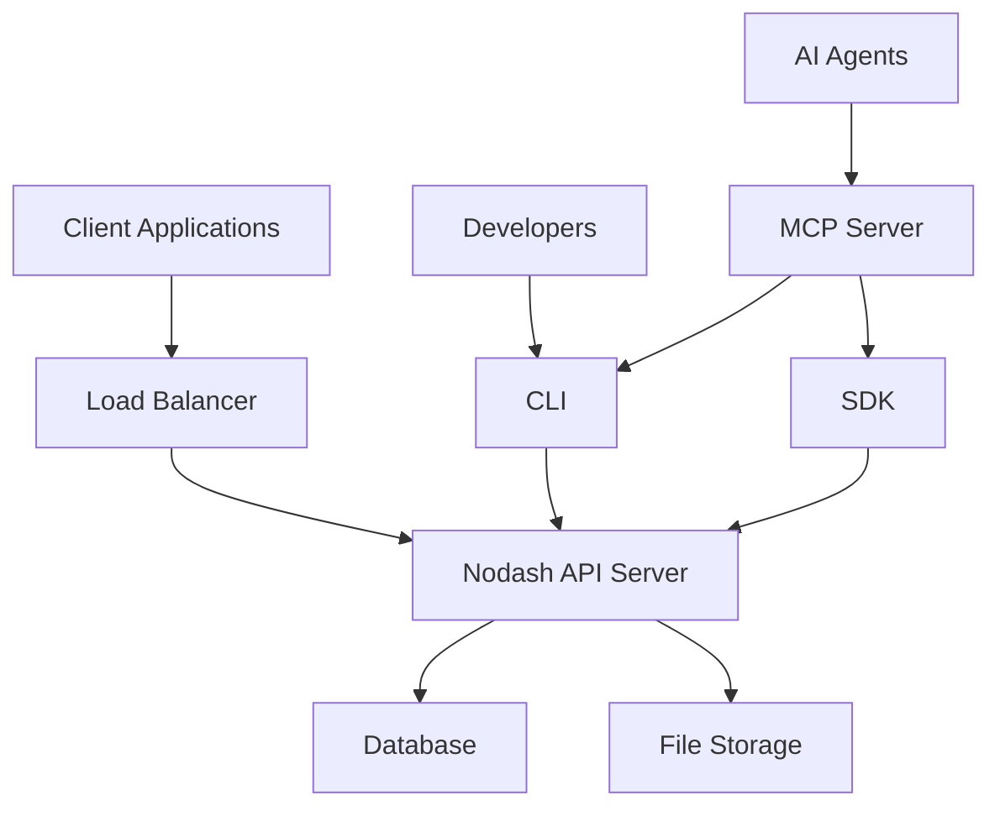
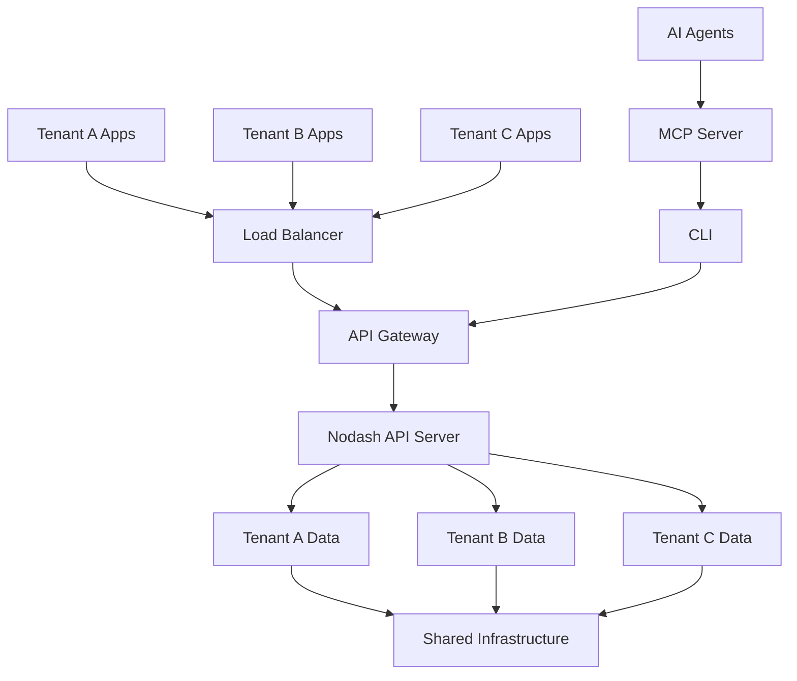

# Nodash - Clean Restart 🚀

> SDK-first architecture that doesn't judge your life choices (but tracks them anyway)

Welcome to the clean, minimal, and delightfully simple Nodash ecosystem! This is a complete restart with a focus on simplicity, strong component boundaries, and code that actually makes sense.

## Architecture Overview

### Component Hierarchy

```
┌─────────────────┐
│   @nodash/mcp   │  ← AI Agent Layer
│  (AI Agents)    │     • MCP Protocol Server
└─────────────────┘     • Tool Discovery
         ↑               • Documentation Serving
┌─────────────────┐     • Agent Optimization
│   @nodash/cli   │  ← Developer Layer
│  (Developer)    │     • Command Line Interface
└─────────────────┘     • Configuration Management
         ↑               • Query Interface
┌─────────────────┐     • Agent Integration
│   @nodash/sdk   │  ← Foundation Layer
│   (Foundation)  │     • HTTP Client
└─────────────────┘     • Event Tracking
                        • User Identification
                        • Health Monitoring
```

### Data Flow Architecture



### Component Responsibilities

**@nodash/sdk (Foundation Layer)**
- HTTP communication with Nodash servers
- Event tracking and user identification
- Health monitoring and configuration management
- Query interface for analytics data
- Multi-tenant authentication handling

**@nodash/cli (Developer Layer)**
- Command-line interface for developers
- Configuration file management
- Query commands for data analysis
- Integration with CI/CD pipelines
- Scripting and automation support

**@nodash/mcp (AI Agent Layer)**
- Model Context Protocol server implementation
- Dynamic tool discovery and exposure
- Documentation serving and example extraction
- Project setup optimization for agents
- Advanced analytics and pattern analysis
- Agent-friendly error handling and responses

### Documentation Sharing System



The documentation sharing system ensures that:
- SDK and CLI documentation is automatically bundled into the MCP server
- AI agents always have access to the latest documentation
- Examples are extracted and validated during the build process
- Documentation updates propagate automatically through the system

## Quick Start (5 Minutes to Glory)

### 1. Install the SDK

```bash
npm install @nodash/sdk
```

```typescript
import { NodashSDK } from '@nodash/sdk';

const nodash = new NodashSDK('https://your-server.com', 'optional-token');

// Track events
await nodash.track('user_signed_up', { plan: 'premium' });

// Identify users
await nodash.identify('user-123', { name: 'John Doe' });

// Check health
const health = await nodash.health();
```

### 2. Use the CLI for Development

```bash
npm install -g @nodash/cli

# Initialize
nodash init --url https://your-server.com --token your-token

# Track events from command line
nodash track "deployment_completed" --properties '{"version": "1.0.0"}'

# Check server health
nodash health
```

### 3. Set up MCP for AI Agents

```bash
npm install -g @nodash/mcp

# Start MCP server
nodash-mcp
```

Then configure in your MCP client:
```json
{
  "mcpServers": {
    "nodash": {
      "command": "nodash-mcp"
    }
  }
}
```

## Package Details

### [@nodash/sdk](./packages/nodash-sdk/README.md) - The Foundation 🏗️

The core client library that everything else builds on. Inspired by BetterStack and PostHog.

**Key Features:**
- Minimal API surface (3 methods: track, identify, health)
- Works with any compatible server
- Optional authentication
- Clear error messages
- Built for both humans and AI agents

### [@nodash/cli](./packages/nodash-cli/README.md) - Developer Tools 🛠️

Command-line interface for developers. Uses the SDK internally.

**Key Features:**
- Simple commands: `init`, `config`, `track`, `health`
- Configuration management
- JSON property support
- Agent-friendly output
- Helpful error messages

### [@nodash/mcp](./packages/nodash-mcp/) - AI Agent Interface 🤖

Model Context Protocol server for AI agents. Consumes CLI and SDK documentation automatically.

**Key Features:**
- Dynamic tool discovery
- Automatic documentation consumption
- Project setup optimization
- CLI command execution
- Self-updating capabilities

## Complete Example: End-to-End Usage

### 1. Server Setup (Your Custom Server)

```typescript
// server.js - Your custom nodash-compatible server
const express = require('express');
const app = express();

app.use(express.json());

app.post('/track', (req, res) => {
  console.log('Event tracked:', req.body);
  res.json({ success: true });
});

app.post('/identify', (req, res) => {
  console.log('User identified:', req.body);
  res.json({ success: true });
});

app.get('/health', (req, res) => {
  res.json({
    status: 'healthy',
    version: '1.0.0',
    uptime: process.uptime(),
    checks: [
      { name: 'server', status: 'pass' }
    ]
  });
});

app.listen(3000, () => {
  console.log('Nodash server running on http://localhost:3000');
});
```

### 2. SDK Usage

```typescript
// app.js - Your application
import { NodashSDK } from '@nodash/sdk';

const nodash = new NodashSDK('http://localhost:3000');

// Track user actions
await nodash.track('page_view', {
  page: '/dashboard',
  user_id: 'user-123'
});

// Identify users
await nodash.identify('user-123', {
  email: 'user@example.com',
  plan: 'pro'
});

// Monitor health
const health = await nodash.health();
console.log('Server status:', health.status);
```

### 3. CLI Usage

```bash
# Set up CLI
nodash init --url http://localhost:3000

# Track events from scripts
nodash track "script_executed" --properties '{"script": "backup.sh", "success": true}'

# Monitor in CI/CD
nodash track "deployment_started" --properties '{"version": "1.2.3", "environment": "production"}'
```

### 4. MCP Integration

The MCP server automatically discovers CLI and SDK capabilities:

```typescript
// AI Agent can use these tools:
// - setup_project: Configure nodash for optimal usage
// - run_cli_command: Execute CLI commands
// - get_documentation: Access latest docs and examples
// - query_events: Access analytics data
// - analyze_events: Perform advanced analytics
```

## Deployment Architecture

### Single-tenant Deployment



### Multi-tenant Deployment



### Data Isolation in Multi-tenant Architecture

**Tenant Identification:**
- API tokens contain tenant information
- Automatic tenant derivation from token patterns
- Request-level tenant context propagation

**Data Segregation:**
- Database-level tenant isolation
- Tenant-scoped queries and operations
- Separate storage paths for tenant data

**Security Boundaries:**
- Token-based authentication per tenant
- API-level access control
- Audit logging per tenant

## Authentication and Multi-tenancy

Nodash supports both single-tenant and multi-tenant deployments with flexible authentication options.

### API Token Formats

**Single-tenant tokens:**
```typescript
const nodash = new NodashSDK('https://api.com', 'sk-your-secret-token');
```

**Multi-tenant tokens (tenant auto-derived):**
```typescript
const nodash = new NodashSDK('https://api.com', 'demo-api-key-tenant1');
// Tenant 'tenant1' is automatically extracted from the token
```

### Token Pattern Recognition

For multi-tenant servers, the SDK automatically derives the tenant from the API token pattern:
- Format: `{prefix}-{suffix}-{tenant}`
- Example: `demo-api-key-tenant1` → tenant: `tenant1`
- Example: `prod-key-company-abc` → tenant: `company-abc`

### Environment-based Configuration

```bash
# Production environment
export NODASH_URL="https://api.nodash.com"
export NODASH_TOKEN="prod-api-key-company"

# Staging environment
export NODASH_URL="https://staging.api.nodash.com"
export NODASH_TOKEN="staging-api-key-company"

# Development environment (no auth required)
export NODASH_URL="http://localhost:3000"
unset NODASH_TOKEN
```

### Security Best Practices

1. **Token Storage**: Store API tokens in environment variables, not in code
2. **Token Rotation**: Regularly rotate API tokens in production environments
3. **Environment Isolation**: Use different tokens for different environments
4. **Minimal Permissions**: Use tokens with minimal required permissions
5. **Secure Transmission**: Always use HTTPS in production environments

## Design Principles

### 1. SDK-First Architecture
Everything builds on the SDK. The CLI uses the SDK, the MCP server uses both CLI and SDK.

### 2. Minimal Code
Less code = fewer bugs = happier developers. We prioritize simplicity over features.

### 3. Strong Boundaries
Each component has a clear, focused responsibility. No circular dependencies.

### 4. Documentation-Driven
The MCP server consumes documentation automatically. When docs change, capabilities update.

### 5. Agent-Friendly
Built with AI agents in mind. Clear interfaces, structured data, helpful examples.

## Development

### Building All Packages

```bash
npm install
npm run build
```

### Testing

```bash
# Run integration tests
node test-integration.js

# Test documentation sync
node test-mcp-docs.js
```

### Project Structure

```
packages/
├── nodash-sdk/          # Core SDK
│   ├── src/
│   │   ├── sdk.ts       # Main SDK class
│   │   ├── http-client.ts
│   │   └── types.ts
│   └── README.md        # Humorous, agent-friendly docs
├── nodash-cli/          # CLI tool
│   ├── src/
│   │   ├── cli.ts       # Main CLI entry
│   │   ├── config.ts    # Configuration management
│   │   └── sdk-wrapper.ts
│   └── README.md        # Developer and agent docs
└── nodash-mcp/          # MCP server
    ├── src/
    │   ├── server.ts    # MCP server implementation
    │   ├── documentation-reader.ts
    │   └── types.ts
    └── README.md        # Agent integration docs
```

## Why This Architecture?

### Before (Complex)
- Circular dependencies
- Overlapping concerns  
- Hard to maintain
- Confusing for contributors

### After (Clean)
- Clear hierarchy: SDK → CLI → MCP
- Single responsibility per component
- Easy to understand and extend
- Agent-friendly by design

## Contributing

1. Keep it simple (complexity is the enemy)
2. Write minimal code (less is more)
3. Update documentation (agents need to understand too)
4. Test your changes (use the integration tests)
5. Follow the architecture (SDK first, always)

## License

MIT - Because sharing is caring, and lawyers are expensive.

---

*Built with ❤️, excessive caffeine, and a commitment to simplicity by the Nodash team*