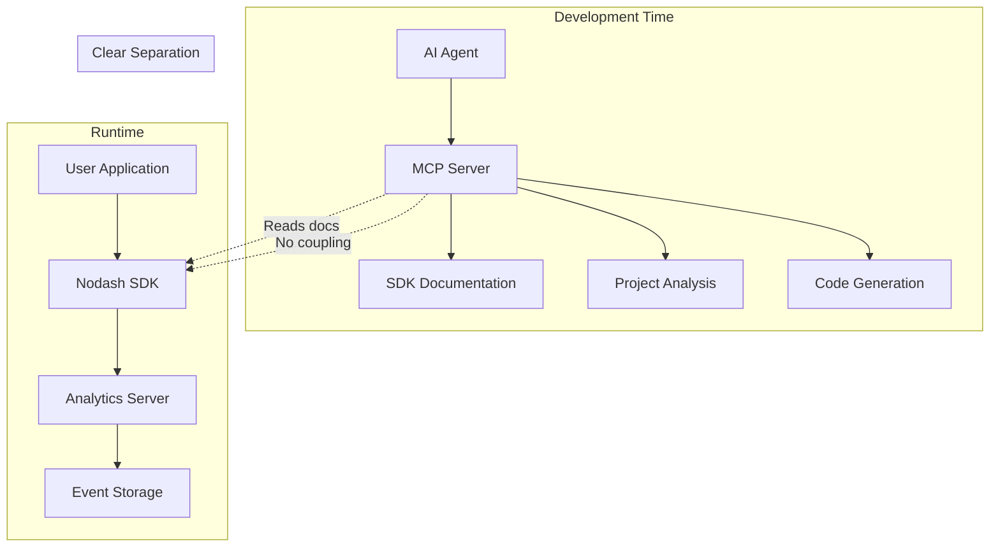

# Nodash Analytics Platform

> Zero-configuration analytics with intelligent MCP integration

A modern, production-ready analytics platform designed for developers who want powerful analytics without the complexity. Features intelligent project analysis, automated setup recommendations, and seamless integration through the Model Context Protocol (MCP).

**Components:**
- 🏗️ **MCP Server**: AI-powered development guidance and project analysis
- 📊 **SDK**: Framework-agnostic client library with TypeScript support
- 🗄️ **Analytics Server**: High-performance data collection and processing

## 🚀 Quick Start

### For Users (Runtime Tracking)

```bash
npm install @nodash/sdk
```

```typescript
import { nodash } from '@nodash/sdk';

// Initialize
nodash.init('your-project-token', {
  apiUrl: 'http://localhost:3001'
});

// Track events (same API as Segment/Mixpanel)
nodash.track('Button Click', { button: 'signup' });
nodash.identify('user-123', { email: 'user@example.com' });
nodash.page('Home', 'Marketing');
```

### For AI Agents (Development Guidance)

The MCP server provides comprehensive resources and prompts for seamless implementation:

- **Resources**: Complete SDK documentation, framework guides, project analysis
- **Prompts**: Implementation workflows, debugging assistance, event design
- **Tools**: Project analysis, code generation, schema management

## 🏗️ Architecture Overview



### Key Principles

1. **Clear Separation**: MCP server provides guidance, SDK handles runtime tracking
2. **Industry Standards**: Same API as Segment/Mixpanel for easy adoption
3. **Documentation-Driven**: MCP server consumes docs, not implementation details
4. **Agent-Optimized**: Structured prompts and resources for seamless AI workflows
5. **Zero Effort**: Users install SDK and track events, agents handle everything else

## 📚 MCP Resources

The MCP server exposes comprehensive documentation as resources:

| Resource | Description |
|----------|-------------|
| `nodash://sdk/readme` | Complete SDK documentation with API reference |
| `nodash://sdk/quick-start` | 5-minute setup guide for any framework |
| `nodash://sdk/framework-guides` | React, Vue, Next.js, Express, Angular, Svelte |
| `nodash://sdk/api-reference` | Complete TypeScript API definitions |
| `nodash://project/analysis` | AI-powered project structure analysis |
| `nodash://events/schema` | Current event definitions and validation |

## 🎯 MCP Prompts

Structured prompts for seamless agent workflows:

| Prompt | Purpose | Arguments |
|--------|---------|-----------|
| `implement-analytics` | Step-by-step implementation guidance | `project_type`, `use_case` |
| `debug-analytics` | Troubleshoot implementation issues | `issue_description`, `error_message` |
| `design-events` | Design event schema for business needs | `business_type`, `key_metrics` |
| `migrate-analytics` | Migrate from existing solutions | `current_solution`, `migration_scope` |
| `optimize-performance` | Performance optimization guidance | `performance_issue` |

## 📊 Industry-Standard SDK API

Compatible with Segment, Mixpanel, and other leading analytics platforms:

### Core Methods

```typescript
// Initialize
nodash.init(token: string, config: Config)

// Track events
nodash.track(event: string, properties?: object)

// Identify users
nodash.identify(userId: string, traits?: object)

// Track page views
nodash.page(name?: string, category?: string, properties?: object)

// Associate with groups
nodash.group(groupId: string, traits?: object)

// Link identities
nodash.alias(userId: string, previousId: string)

// Reset state
nodash.reset()

// Manual flush
nodash.flush()
```

### Configuration Options

```typescript
{
  apiUrl: string;           // Analytics server endpoint
  debug?: boolean;          // Enable debug logging
  batchSize?: number;       // Events per batch (default: 10)
  flushInterval?: number;   // Auto-flush interval (default: 10s)
  maxRetries?: number;      // Max retry attempts (default: 3)
  // ... more options
}
```

## 🛠️ Framework Integration

### React

```tsx
import { useAnalytics } from './hooks/useAnalytics';

function ProductCard({ product }) {
  const { track } = useAnalytics();
  
  const handlePurchase = () => {
    track('Product Purchased', {
      product_id: product.id,
      amount: product.price,
      category: product.category
    });
  };
  
  return <button onClick={handlePurchase}>Buy Now</button>;
}
```

### Vue.js

```vue
<template>
  <button @click="trackPurchase">Buy Now</button>
</template>

<script>
export default {
  methods: {
    trackPurchase() {
      this.$analytics.track('Product Purchased', {
        product_id: this.product.id,
        amount: this.product.price
      });
    }
  }
}
</script>
```

### Express.js

```typescript
app.use((req, res, next) => {
  req.analytics = analytics;
  next();
});

app.post('/api/signup', (req, res) => {
  req.analytics.identify(userId, { email });
  req.analytics.track('User Signed Up', { source: 'api' });
  res.json({ success: true });
});
```

## 🤖 Agent Workflow Example

1. **User Request**: "Help me add analytics to my React app"
2. **Agent Analysis**: Calls `analyze_project` tool → detects React framework
3. **Documentation Access**: Reads `nodash://sdk/framework-guides` resource
4. **Code Generation**: Calls `generate_integration_code` with React parameters
5. **Implementation**: Provides complete, working React integration code
6. **Guidance**: Uses prompts for setup and debugging assistance

**Result**: Zero effort for user - agent handles all the heavy lifting!

## 📦 Package Structure

```
packages/
├── nodash-mcp-server/     # MCP server for development guidance
│   ├── src/server.ts      # Enhanced server with resources & prompts
│   └── dist/              # Compiled JavaScript
├── nodash-sdk/            # Runtime tracking SDK
│   ├── src/index.ts       # Industry-standard API implementation
│   ├── docs/              # Comprehensive documentation
│   │   ├── quick-start.md
│   │   ├── framework-guides.md
│   │   └── api-reference.md
│   └── dist/              # Compiled JavaScript
└── nodash-analytics-server/ # Data storage and management
    ├── src/index.ts       # Express.js API server
    └── dist/              # Compiled JavaScript
```

## 🚀 Development Setup

### Build All Packages

```bash
npm install
npm run build
```

### Start Analytics Server

```bash
npm run start:analytics
```

### Start MCP Server

```bash
npm run start:mcp
```

### Run Enhanced Demo

```bash
node demo-enhanced-architecture.js
```

## 🎯 Key Features

### SDK Features
- ✅ Industry-standard API (Segment/Mixpanel compatible)
- ✅ Automatic batching and retry mechanisms
- ✅ TypeScript support with full type safety
- ✅ Framework-specific integration patterns
- ✅ Session tracking and user identification
- ✅ Performance optimization features
- ✅ Comprehensive error handling

### MCP Server Features
- ✅ Complete SDK documentation as resources
- ✅ Structured prompts for agent workflows
- ✅ AI-powered project analysis
- ✅ Framework-specific code generation
- ✅ Documentation-driven architecture (no coupling)
- ✅ Extensible prompt system

### Analytics Server Features
- ✅ RESTful API for event storage
- ✅ Batch processing for high-volume events
- ✅ Schema management and validation
- ✅ JSONL storage for efficient querying
- ✅ Health monitoring and status endpoints

## 📖 Documentation

- [SDK Quick Start Guide](packages/nodash-sdk/docs/quick-start.md)
- [Framework Integration Guides](packages/nodash-sdk/docs/framework-guides.md)
- [Complete SDK API Reference](packages/nodash-sdk/README.md)
- [MCP Setup Guide](MCP_SETUP.md)

## 🎨 Migration Support

Easy migration from existing analytics solutions:

| From | Migration Notes |
|------|----------------|
| **Segment** | Same API - drop-in replacement! |
| **Mixpanel** | Same core methods, minimal changes |
| **Google Analytics** | Event mapping provided |
| **Amplitude** | User identification patterns similar |

## 🏆 Benefits

### For Developers
- Familiar API patterns from industry leaders
- Comprehensive documentation and examples
- Framework-specific integration guides
- TypeScript support with full type safety

### For AI Agents
- Structured resources and prompts
- Complete documentation access
- Code generation capabilities
- Debugging and optimization guidance

### For Organizations
- Clear separation of concerns
- Independent component evolution
- Production-ready performance features
- Extensible architecture for future needs

## 🤝 Contributing

1. Fork the repository
2. Create a feature branch
3. Make your changes
4. Add tests and documentation
5. Submit a pull request

## 📄 License

MIT License - see [LICENSE](LICENSE) file for details.

---

**Ready to get started?** Install the SDK and let AI agents handle the implementation! 🚀 